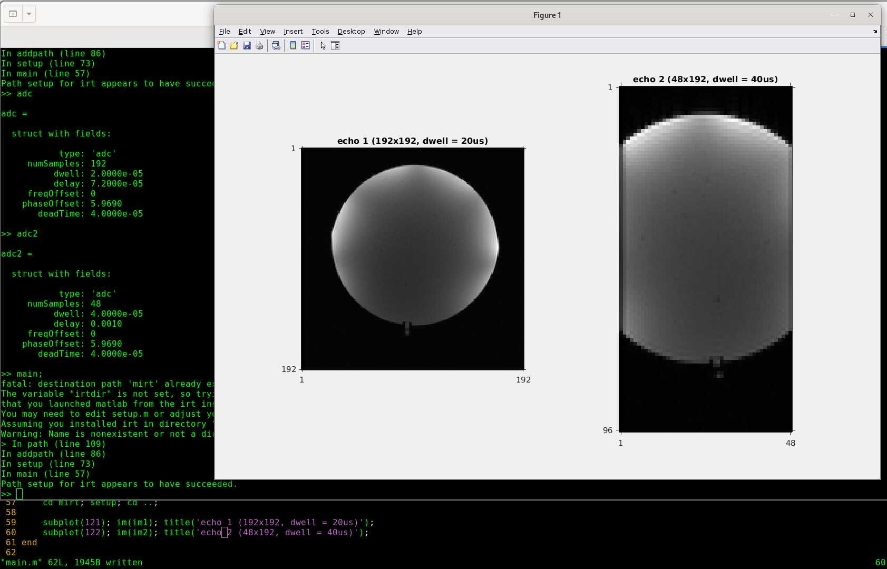

# 2D spoiled GRE sequence for Pulseq on GE v2 (pge2)

This is the 'official' demo sequence, and it’s a good idea to run it first so you understand the workflow. 
Be sure to read through **main.m** and **write2DGRE.m** carefully, including all comments.

Use this demo with the most recent version of the 
**[pge2 interpreter](https://github.com/GEHC-External/pulseq-ge-interpreter )**.

To download the required MATLAB packages, generate the pge sequence file, and reconstruct the data, see **setup.m** and **main.m** in this folder.

For GE scanner instructions, refer to the user guide:
https://github.com/jfnielsen/TOPPEpsdSourceCode/tree/UserGuide/v7

The output of **main.m** is shown below. The images on the left and right correspond to the first and second echoes, respectively.

<!--
Tested on the following system(s):  
| Scanner | Scanner SW version | pge2 version | PulCeq version |  
| --- | --- | --- | --- |
| GE UHP | MR30.1\_R01 | [v2.5.2.1](https://github.com/jfnielsen/TOPPEpsdSourceCode/releases/tag/v2.5.2.1) | [v2.5.2.1](https://github.com/HarmonizedMRI/PulCeq/releases/tag/v2.5.2.1) |  

| GE MR750 | MR30.1\_R01 | [v2.5.0-beta](https://github.com/jfnielsen/TOPPEpsdSourceCode/releases/tag/v2.5.0-beta) | [v2.4.0-alpha](https://github.com/HarmonizedMRI/PulCeq/releases/tag/v2.4.0-alpha) |  
| GE MR750 | MR30.1\_R01 | [v2.3.0](https://github.com/jfnielsen/TOPPEpsdSourceCode/releases/tag/v2.3.0) | [v2.2.2](https://github.com/HarmonizedMRI/PulCeq/releases/tag/v2.2.2) |
-->

