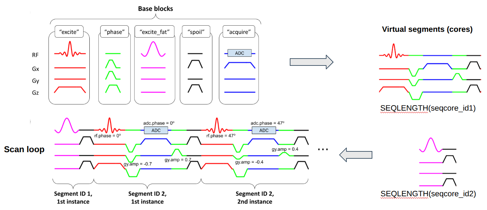

# Pulseq on GE v2 (pge2) examples 

**Table of Contents**  
[Overview and getting started](#overview-and-getting-started)  
[Creating the .seq file](#creating-the-pulseq-file)  
[Safety management](#safety-management)  

## News (updated Nov 2025)

The pge2 interpreter EPIC source code will from now on be hosted by GE at
https://github.com/GEHC-External/pulseq-ge-interpreter.
For access, please contact your GE representative.


## Overview and getting started

This repository contains examples of how to prepare and run 
[Pulseq](https://pulseq.github.io/)
sequences on GE scanners using the 'Pulseq on GE v2' (pge2) interpreter.

The pge2 interpreter is quite powerful in the sense that it directly translates
the various events specified in the Pulseq file to the hardware,
which allows great flexibility in sequence design.
This also means that care has to be taken when designing the Pulseq file, such as choosing
gradient and RF raster times that are in fact supported by GE hardware.
The information on this page is designed to guide you in creating robust Pulseq sequences for GE scanners.

It is recommended to first simulate the sequence in the GE simulator (WTools),
which helps to identify most potential issues before going to the scanner.
The simulator output (xml files) can be compared directly with the original .seq file using the `pge2.validate()` function,
to ensure correct executation.


### Workflow 

For the most up to date implementation of these steps, 
see the [2DGRE](./2DGRE/) example in this folder.

1. Create the .seq file more or less as one usually does, but see the information below about adding TRID labels and other considerations.

2. Convert the .seq file to a PulCeq sequence object (`ceq`). 
   NB! Make sure the versions of the PulCeq MATLAB toolbox and the pge2 interpreter are compatible -- see below.

3. Check the sequence with `pge2.check()` and `pge2.validate()`.
   See https://github.com/HarmonizedMRI/PulCeq/tree/tv7/matlab/%2Bpge2 for details.

4. If step 3 runs without errors, write the Ceq object to file with `writeceq()`.

5. Execute the .pge file with the pge2 interpreter.

An alternative workflow is to prescribe the sequence interactively using [Pulserver](https://github.com/INFN-MRI/pulserver/).


### Obtaining the software

To use the pge2 Pulseq interpreter, you will need two separate pieces of softare:
the PulCeq MATLAB toolbox, 
and the EPIC source code (or compiled binaries) for the interpreter itself.

PulCeq is available here: https://github.com/HarmonizedMRI/PulCeq/releases  
The pge2 interpreter is available here: https://github.com/GEHC-External/pulseq-ge-interpreter 

Beginning with v2.5.2.0, the version numbers of PulCeq and pge will match.

The version number scheme is:
```
v2.<major>.<minor>.<patch>

<major>    Backward-incompatible changes, e.g., to the .pge file format
<minor>    Backward-compatible feature additions, e.g., functions for sequence display/checks
<pathc>    minor changes and bug fixes 
```

For example, if using pge2 interprever v2.5.2.0, the recommended PulCeq version is v.2.5.2.0 
but any version v2.5.x.y should produce a .pge file that can be executed by the interpreter.

Version history:

| pge2 (tv7) | Compatible with:   | Comments |
| ---------- | ------------------ | -------- |
| [v2.5.2.1](https://github.com/jfnielsen/TOPPEpsdSourceCode/releases/tag/v2.5.2.0) | [PulCeq v2.5.2.x](https://github.com/HarmonizedMRI/PulCeq/releases/tag/v2.5.2.0) | (latest) new checks; rotation event support|
| [v2.5.0-beta3](https://github.com/jfnielsen/TOPPEpsdSourceCode/releases/tag/v2.5.0-beta3) | [PulCeq v2.4.1](https://github.com/HarmonizedMRI/PulCeq/releases/tag/v2.4.1) | Added MP26 support. |
| [v2.5.0-beta2](https://github.com/jfnielsen/TOPPEpsdSourceCode/releases/tag/v2.5.0-beta2) | [PulCeq v2.4.0-alpha](https://github.com/HarmonizedMRI/PulCeq/releases/tag/v2.4.0-alpha) | DV26 support. Bug fixes. |
| [v2.5.0-beta](https://github.com/jfnielsen/TOPPEpsdSourceCode/releases/tag/v2.5.0-beta) | [PulCeq v2.4.0-alpha](https://github.com/HarmonizedMRI/PulCeq/releases/tag/v2.4.0-alpha) | Allow segments without gradients to pass heating check. |
| [v2.4.0-alpha](https://github.com/jfnielsen/TOPPEpsdSourceCode/releases/tag/v2.4.0-alpha) | [PulCeq v2.3.0-alpha](https://github.com/HarmonizedMRI/PulCeq/releases/tag/v2.3.0-alpha) | Remove limit on total number of Pulseq blocks. |
| [v2.3.0](https://github.com/jfnielsen/TOPPEpsdSourceCode/releases/tag/v2.3.0) | [PulCeq v2.2.3-beta](https://github.com/HarmonizedMRI/PulCeq/releases/tag/v2.2.3-beta) | Supports 3D rotations |


## Creating the Pulseq file

The key points to keep in mind when creating a .seq file for the pge2 interpreter are summarized here.

### Define segments (block groups) by adding TRID labels

As in tv6, we define a 'segment' as a consecutive sub-sequence of Pulseq blocks that are always executed together,
such as a TR or a magnetization preparation section.
The GE interpreter needs this information to construct the sequence.

To clarify this concept, we define the following:
* **base block:** A Pulseq block with normalized waveform amplitudes. The base blocks are the fundamental building blocks, or 'atoms', of the sequence.
* **virtual segment:** A sequence of base blocks in a particular order (with normalized amplitudes). 
You can think of this as an abstract segment.
* **segment instance:** a segment realization/occurrence within the pulse sequence, with specified waveform amplitudes and phase/frequency offsets.
A pulse sequence typically contains multiple instances of any given virtual segment:



In pratice, this means that you must **mark the beginning of each segment in the sequence with the TRID label** in the Pulseq toolbox.
Example:
```matlab
inversionVirtualSegmentID = 4;  % any unique integer, in no particular order
imagingVirtualSegmentID = 2;

% Play an instance of the inversion virtual segment
seq.addBlock(rf_inv, mr.makeDelay(1), mr.makeLabel('SET', 'TRID', inversionVirtualSegmentID));

for i = 1:Ny
    % Play an instance of the imaging virtual segment
    seq.addBlock(rf, gz, mr.makeLabel('SET', 'TRID', virtualSegmentID));
    ...
    seq.addblock(gxPre, mr.scaleGrad(gy, (i-Ny/2-1)/(Ny/2)));
    seq.addBlock(gx, adc);
    seq.addblock(gxSpoil, mr.scaleGrad(gy, -(i-Ny/2-1)/(Ny/2)));
    ...
end
```
See also the examples included in this repository.
The TRID can be **any unique positive integer**, in no particular order. 
The TRID labels the **virtual** segment, NOT the segment instance.

When assigning TRID labels, **follow these rules**:
1. Add a TRID label to the first block in a segment. 
2. Gradient waveforms must ramp to zero at the beginning and end of a segment.

Dynamic sequence changes that **do not** require the creation of an additional (unique) TRID label:
* gradient/RF amplitude scaling
* RF/receive phase 
* duration of a pure delay block (block containing only a delay event)
* gradient rotation

Dynamic sequence changes that **do** require a separate segment (TRID) to be assigned:
* waveform shape or duration
* block execution order within a segment
* duration of any of the blocks within a segment, unless it is a pure delay block

Other things to note:
* The interpreter inserts a 117us dead time (gap) at the end of each segment instance.
Please account for this when creating your .seq file.
(Actually, this gap is adjustable on the scanner -- it is equal to 17us plus the ssi time.)
* Each **virtual** segment takes up waveform memory in hardware, so it is generally good practice 
to divide your sequence into as few virtual segments as possible, each being as short as possible.
  

### Set system hardware parameters

**Raster times:**  
Unlike tv6, the waveforms in the .seq file are NOT interpolated to 4us, but are instead
placed directly onto the hardware. 
This is far more memory efficient and generally more accurate.
Therefore, the following raster time requirements must be met in the .seq file:
* gradient raster time must be on a 4us boundary
* RF raster time must be on a 2us boundary
* ADC raster time must be an integer multiple of 2us
* block duration must be a on a 4us boundary

**Event delays:**  
* gradient event delays must be an integer multiple of 4us
* RF event delays must be an integer multiple of 2us
* ADC event delays must be an integer multiple of 1us

**Minimum gaps before and after RF/ADC events:**   
Like on other vendors, there is some time required to turn on/off the RF amplifier and ADC card.
To our knowledge, on GE these are:
```
Time to turn RF amplifier ON = 72us             # RF dead time
Time to turn RF amplifier OFF = 54us            # RF ringdown time
Time to turn ADC ON = 40us                      # ADC dead time
Time to turn ADC OFF = 0us
```

The key thing to note is that the dead/ringdown intervals from one RF/ADC event must not overlap with those from another RF/ADC event.
For more information, see https://github.com/HarmonizedMRI/PulCeq/tree/tv7/matlab/%2Bpge2.

Also note that these times do NOT necessarily correspond to the values of `rfDeadTime`, `rfRingdownTime`, and `adcDeadTime`
you should use when creating the .seq file.
While the Pulseq MATLAB toolbox encourages the insertion of RF/ADC dead/ringdown times at the beginning
and end of each block, this is generally not necessary on GE,
and it is perfectly ok to override that behavior to make the sequence more time-efficient.

**Examples:**
```matlab
sys = mr.opts('maxGrad', 40, 'gradUnit','mT/m', ...
              'maxSlew', 180, 'slewUnit', 'T/m/s', ...
              'rfDeadTime', 100e-6, ...
              'rfRingdownTime', 60e-6, ...
              'adcDeadTime', 40e-6, ...
              'adcRasterTime', 2e-6, ...
              'rfRasterTime', 2e-6, ...
              'gradRasterTime', 4e-6, ...
              'blockDurationRaster', 4e-6, ...
              'B0', 3.0);
```
Note, however, that it may be possible to set some or all of the various dead- and ringdown times to 0
as long as there is a gap in the previous/subsequent block to allow time 
to turn on/off RF and ADC events.
This is because the block boundaries 'disappear' inside a segment.
If you know this to be the case, you may want to try the following, more time-efficient, alternative:

```matlab
sys = mr.opts('maxGrad', 40, 'gradUnit','mT/m', ...
              'maxSlew', 180, 'slewUnit', 'T/m/s', ...
              'rfDeadTime', 0, ...
              'rfRingdownTime', 0, ...
              'adcDeadTime', 0, ...
              'adcRasterTime', 2e-6, ...
              'rfRasterTime', 2e-6, ...
              'gradRasterTime', 4e-6, ...
              'blockDurationRaster', 4e-6, ...
              'B0', 3.0);
```
If this results in overlapping RF/ADC dead/ringdown times, you would then adjust the timing as needed
by modifying the event delays and block durations when creating the .seq file.


### Additional recommendations

* **Pre-define events outside of the main loop in your .seq file creation script.**
GE sequences are built on the idea that there is a small set of pre-defined RF/gradient events,
that repeat many times throughout the sequence except with (possibly) varying amplitudes,
phase offsets, or (gradient) rotation;
these pre-defined events give rise to the base blocks described above.
It is therefore highly recommended to define events once, and then use mr.scaleGrad() to scale
them as needed inside the main loop.
This ensures proper detection of the base blocks during the seq2ceq.m conversion stage;
if creating independent events inside the main loop using repeated calls to, e.g., `mr.makeTrapezoid()`, the
resulting trapezoids generally do not have identical shapes and are therefore not instances of a shared base block.

* **Avoid setting waveform amplitudes to exactly zero -- instead, set to `eps` or a similarly small number.**
This is recommended because the Pulseq toolbox may not recognize, e.g., a zero-amplitude trapezoid
as exactly that, which is in conflict with the GE sequence model.

* **Use rotation events,** rather than rotating gradients manually or using the older
`mr.rotate` or `mr.rotate3D` functions (in the core Pulseq toolbox).
Rotation events are a new feature in Pulseq, see https://github.com/pulseq/pulseq/discussions/117.
**NB! The rotation is applied to the entire segment as a whole.**
In other words, the interpreter cannot rotate each block within a segment independently.
If a segment contains multiple blocks with different rotation matrices, **only the last** of the non-identity rotations are applied. 
If you find this to be the case, redesign the segment definitions to achieve the desired rotations.

* Check your sequence using **pge2.validate()**, and plot the Ceq object using
**pge2.plot()**.
This helps catch errors before simulating in WTools or scanning.


### Sequence timing: Summary and further comments

* When loading a segment, the interpreter inserts a 117us dead time at the end of each segment.
* The default values for `rfDeadTime`, `rfRingdownTime`, and `adcDeadTime` in the Pulseq MATLAB toolbox
were set with Siemens scanners in mind, and as just discussed, setting them to 0 can in fact be a preferred option in many cases for GE users.
This is because the default behavior in the Pulseq toolbox is to quietly insert corresponding gaps at the 
start end end of each block, however this is not necessary on GE since the block boundaries 'disappear' within a segment.
* In the internal sequence representation used by the interpreter, RF and ADC events are delayed by about 100us to account for gradient delays.
Depending on the sequence details, you may need to extend the segment duration to account for this.

The `pge2.check()` and `pge2.validate()` functions help to catch many issues before attempting to simulate or run on the scanner.


## Safety management

### PNS

This is currently built in to the MATLAB function `pge2.check()`.

### Gradient and RF subsystem protection, and patient SAR

This is handled for you by the interpreter, using a sliding-average estimation that parses through
**the first 40,000 blocks** in the sequence (or until the end of the scan is reached, whichever comes first).
It is your responsibility to ensure that the gradient/RF power in the remainder of the sequence
does not exceed that in the first 40,000 blocks.
This limit (40,000) is due to apparent memory limitations and has been determined empirically.


